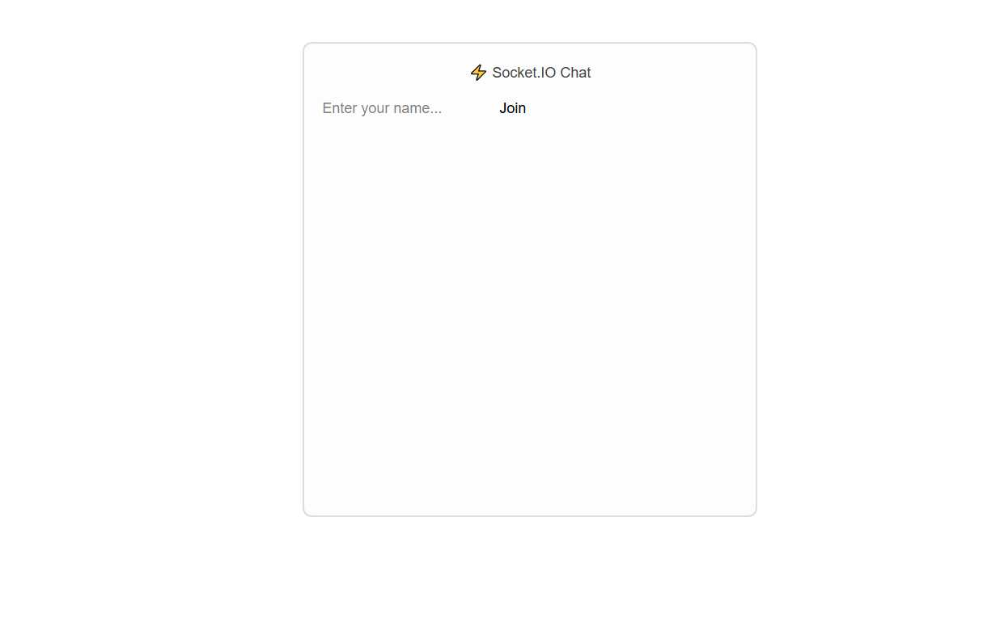
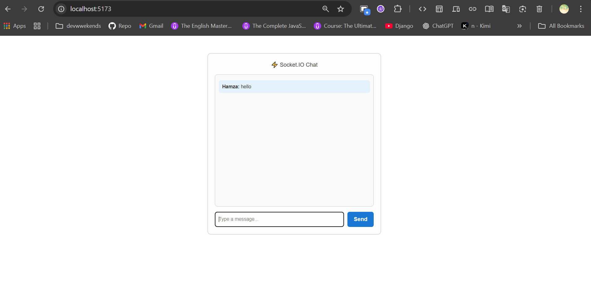
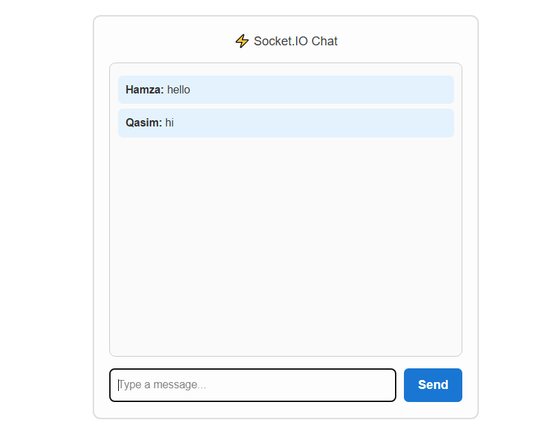
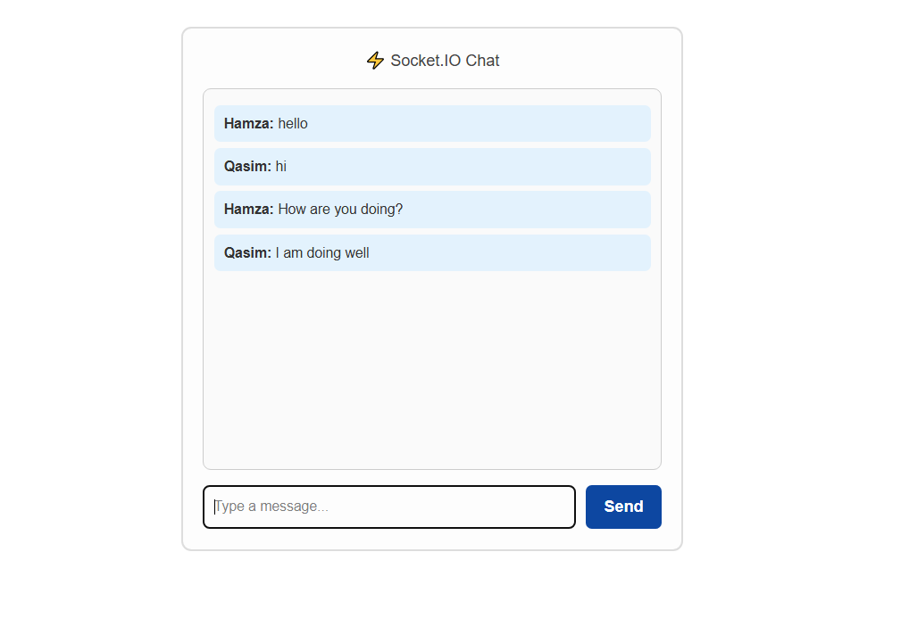

# FastAPI + Socket.IO + React (Vite) Chat App — Full Documentation (Detailed)

This document is an expanded, line-by-line explanation of a small real-time chat project using **FastAPI** (backend) with **python-socketio** (Socket.IO server) and **React + Vite** (frontend) with **socket.io-client**.

It includes: project structure, exact commands, full annotated code for backend and frontend, explanations of every important concept, debugging tips, and production notes.

---

## 🔹 Project structure (what goes where)

```
chatapp_react_fastapi/
├── server/                 # Backend (FastAPI + python-socketio)
│   ├── main.py             # Entry point for backend server (Socket.IO mounted)
│   └── venv/               # Optional: Python virtual environment
│
├── client/               # Frontend (Vite + React)
│   ├── index.html
│   ├── package.json
│   └── src/
│       ├── main.jsx        # Vite entry
│       └── App.jsx         # Socket.IO React component

```

---

## 🔹 Key concepts (short explanations)

**ASGI** — asynchronous server gateway interface. FastAPI is ASGI-compatible and python-socketio can run as an ASGI app (so both HTTP routes and Socket.IO can co-exist).

**Socket.IO vs WebSocket** — Socket.IO is **not just WebSocket**. It’s a higher-level library that **uses WebSocket under the hood** (when possible) but also supports **long-polling** as a fallback. It adds extra features like:

- automatic reconnection
- rooms
- namespaces
- custom events

So when you see:

```jsx
transports: ["websocket"];
```

it means: _“Force the client to try only WebSocket transport”_. Normally, Socket.IO will try polling first, then upgrade to WebSocket. You don’t have to force it, but developers sometimes add this option to skip polling and go straight to WebSockets.

👉 In summary: you **are using Socket.IO**, not raw WebSockets. But Socket.IO internally may use WebSocket as the transport. That’s why `transports: ["websocket"]` appears in code.

**CORS (Cross-Origin Resource Sharing)** — browsers restrict cross-origin requests unless server sends `Access-Control-Allow-Origin`. When using a frontend dev server (Vite) on `http://localhost:5173` and backend on `http://127.0.0.1:8000`, the backend must explicitly allow that origin.

**`uvicorn main:socket_app` vs `uvicorn main:app`** — If you mount Socket.IO with `socketio.ASGIApp(...)`, you must run the ASGI object that contains socket handling. If you run `main:app` (FastAPI app only), the `/socket.io/` path will not be served → 404.

---

## 🔹 Backend — Full annotated code and explanation

**Install packages (recommended in a venv):**

```bash
pip install fastapi uvicorn python-socketio[asgi]

```

### `server/main.py`

```python
import uvicorn
import socketio
from fastapi import FastAPI
from fastapi.middleware.cors import CORSMiddleware

FRONTEND_ORIGINS = ["http://localhost:5173"]

# -----------------------------
# AsyncServer explained
# -----------------------------
# sio = socketio.AsyncServer(cors_allowed_origins=FRONTEND_ORIGINS, async_mode="asgi")
#
# - AsyncServer: the main Socket.IO server object.
# - cors_allowed_origins=FRONTEND_ORIGINS: allows frontend browser at this origin.
# - async_mode="asgi": tells python-socketio to run in ASGI mode (for FastAPI).

sio = socketio.AsyncServer(cors_allowed_origins=FRONTEND_ORIGINS, async_mode="asgi")

app = FastAPI()
socket_app = socketio.ASGIApp(sio, other_asgi_app=app)

app.add_middleware(
    CORSMiddleware,
    allow_origins=FRONTEND_ORIGINS,
    allow_credentials=True,
    allow_methods=["*"],
    allow_headers=["*"],
)

@app.get("/")
async def root():
    return {"message": "Socket.IO server running!"}

@sio.event
async def connect(sid, environ):
    print("🔌 Client connected:", sid)

@sio.event
async def disconnect(sid):
    print("❌ Client disconnected:", sid)

@sio.event
async def chat_message(sid, data):
    print(f"💬 {sid} says: {data}")
    await sio.emit("chat_message", {"sid": sid, "message": data})

if __name__ == "__main__":
    uvicorn.run("main:socket_app", host="127.0.0.1", port=8000, reload=True)

```

---

## 🔹 What does this mean?

### `sio = socketio.AsyncServer(...)`

1. **`socketio.AsyncServer`**
   - Creates a Socket.IO server that supports async functions.
   - Without this, you can’t declare `async def` event handlers.
2. **`cors_allowed_origins=FRONTEND_ORIGINS`**
   - Controls which frontend origins (domains/ports) can open a Socket.IO connection.
   - Example: if frontend runs at `http://localhost:5173`, we must list it here.
3. **`async_mode="asgi"`**
   - Tells python-socketio to run in ASGI mode.
   - This is crucial because FastAPI runs as ASGI. This makes Socket.IO compatible with FastAPI.

👉 In simple words: this line **creates the Socket.IO server, allows the React origin, and ensures it integrates with FastAPI.**

---

## 🔹 Frontend (React + Vite)

```jsx
import { useEffect, useState, useRef } from "react";
import { io } from "socket.io-client";

export default function App() {
  const [messages, setMessages] = useState([]);
  const [input, setInput] = useState("");
  const socketRef = useRef(null);

  useEffect(() => {
    const socket = io("http://127.0.0.1:8000", {
      path: "/socket.io/",
      transports: ["websocket"], // force WebSocket (optional)
    });
    socketRef.current = socket;

    socket.on("connect", () => console.log("✅ Connected", socket.id));

    socket.on("chat_message", (data) => {
      setMessages((prev) => [...prev, `${data.sid}: ${data.message}`]);
    });

    return () => socket.disconnect();
  }, []);

  function sendMessage() {
    if (socketRef.current && input.trim()) {
      socketRef.current.emit("chat_message", input);
      setInput("");
    }
  }

  return (
    <div>
      <h1>Chat</h1>
      <div>
        {messages.map((m, i) => (
          <div key={i}>{m}</div>
        ))}
      </div>
      <input value={input} onChange={(e) => setInput(e.target.value)} />
      <button onClick={sendMessage}>Send</button>
    </div>
  );
}
```

---

✅ Recap:

- You are **not using raw WebSockets**.
- You are **using Socket.IO**, which may use WebSocket internally.
- The `transports: ["websocket"]` option just tells Socket.IO client to **skip polling and use only WebSocket**.
- Removing it will still work (Socket.IO will try polling then upgrade to WebSocket automatically).







---

# ⚠️ Issues Faced and Explanations

### 1. **404 Not Found on `/socket.io/`**

- **What happened:** You started the server with `uvicorn main:app`. This only runs the FastAPI app.
- **Why:** The `/socket.io/` route belongs to the `socketio.ASGIApp`, not the pure FastAPI app.
- **Effect:** When the React frontend tried to connect (`http://localhost:8000/socket.io/?EIO=4…`), the server didn’t recognize the route → **404 Not Found**.
- **Fix:** Run `uvicorn main:socket_app` instead, because `socket_app` is the combined FastAPI + Socket.IO app.

---

### 2. **CORS (Cross-Origin Resource Sharing) Errors**

- **What happened:** The frontend was on `http://localhost:5173` (Vite dev server), and the backend was on `http://127.0.0.1:8000`.
- **Why:** Browsers block requests if frontend and backend are on different origins, unless the backend explicitly allows it.
- **Effect:** Your frontend couldn’t connect, and the browser console showed **CORS errors**.
- **Fix:** Added

  - `CORSMiddleware` in FastAPI.
  - `cors_allowed_origins=["http://localhost:5173"]` in `AsyncServer`.
    This allowed only your React frontend to connect.

---

### 3. **Import Error: `socketio` Not Found**

- **What happened:** You imported `socketio` in Python but didn’t have it installed.
- **Why:** The package `python-socketio` was missing in your virtual environment.
- **Effect:** Python crashed with `ModuleNotFoundError: No module named 'socketio'`.
- **Fix:** Installed it with:

  ```bash
  pip install python-socketio[asgi]
  ```

  The `[asgi]` part installs extra dependencies needed for FastAPI/ASGI support.

---

### 4. **React Error: `socketRef is not defined`**

- **What happened:** In React code, you tried to use `socketRef.current` but never declared `socketRef`.
- **Why:** React needs a `useRef` hook to store socket instances across renders.
- **Effect:** The frontend crashed with `ReferenceError: socketRef is not defined`.
- **Fix:** Declared it properly:

  ```jsx
  const socketRef = useRef(null);
  ```

---

### 5. **WebSocket Closed Before Connection Established**

- **What happened:** In the browser console:

  ```
  WebSocket is closed before the connection is established
  ```

- **Why:** The client tried to connect to the `/socket.io/` endpoint, but since you were running `main:app` (not `main:socket_app`), Socket.IO wasn’t active.
- **Effect:** Client opened a connection, but server didn’t handle the handshake → **connection closed immediately**.
- **Fix:** Run `uvicorn main:socket_app --reload`.

---

### 6. **Confusion: “I’m using Socket.IO, not WebSockets”**

- **What happened:** You thought that enabling `transports: ["websocket"]` meant you were using raw WebSocket.
- **Why:** Socket.IO **is not WebSocket**, but it can _use WebSocket under the hood_ as its transport.
- **Effect:** Misunderstanding. The client still speaks the **Socket.IO protocol**, not plain WebSocket. The difference is:

  - **WebSocket:** bare minimum, only send/receive messages.
  - **Socket.IO:** higher-level protocol that adds events, reconnection, rooms, broadcasting, and fallbacks (polling → WebSocket).

- **Fix:** Realized that `"transports: ['websocket']"` simply forces Socket.IO to skip polling and go straight to WebSockets internally. You are still using **Socket.IO features**, not raw WebSocket.

---

# 🚨 Running Issues Faced

### 1. **Starting with wrong app (`main:app` instead of `main:socket_app`)**

- **Symptom:**

  - Server ran fine, but frontend showed `404 Not Found` for `/socket.io/`.

- **Why:**

  - `uvicorn main:app` only runs FastAPI routes, not the Socket.IO app.

- **Effect:**

  - React couldn’t establish a socket connection → constant **404 errors**.

- **Fix:**

  - Run the combined app:

    ```bash
    uvicorn main:socket_app --reload --host 127.0.0.1 --port 8000
    ```

---

### 2. **Missing Dependency (`socketio` Import Error)**

- **Symptom:**

  - Python crashed with: `ModuleNotFoundError: No module named 'socketio'`.

- **Why:**

  - The `python-socketio` package wasn’t installed in your venv.

- **Effect:**

  - Backend couldn’t start at all.

- **Fix:**

  ```bash
  pip install python-socketio[asgi]
  ```

---

### 3. **CORS Error when running frontend (React Vite)**

- **Symptom:**

  - Console error:

    ```
    Access to XMLHttpRequest at 'http://localhost:8000/socket.io/' has been blocked by CORS
    ```

- **Why:**

  - React ([http://localhost:5173](http://localhost:5173)) and FastAPI ([http://127.0.0.1:8000](http://127.0.0.1:8000)) are **different origins**.
  - Backend didn’t explicitly allow frontend origin.

- **Effect:**

  - Socket.IO connection was **blocked by browser security**.

- **Fix:**

  - Add `CORSMiddleware` to FastAPI.
  - Add `cors_allowed_origins=["http://localhost:5173"]` to `AsyncServer`.

---

### 4. **WebSocket Closed Immediately**

- **Symptom:**

  - Console showed:

    ```
    WebSocket is closed before the connection is established
    ```

- **Why:**

  - Backend didn’t respond to the Socket.IO handshake (because wrong app was running).

- **Effect:**

  - Frontend kept retrying but failed to connect.

- **Fix:**

  - Run the correct app (`main:socket_app`).

---

### 5. **Frontend Hook Error (`socketRef is not defined`)**

- **Symptom:**

  - React crashed with: `ReferenceError: socketRef is not defined`.

- **Why:**

  - Used `socketRef` without declaring it.

- **Effect:**

  - Frontend stopped rendering.

- **Fix:**

  ```jsx
  const socketRef = useRef(null);
  ```

---

✅ After fixing these, the project **runs successfully**:

- Backend on `http://127.0.0.1:8000`
- Frontend on `http://localhost:5173`
- Real-time chat works.

---
